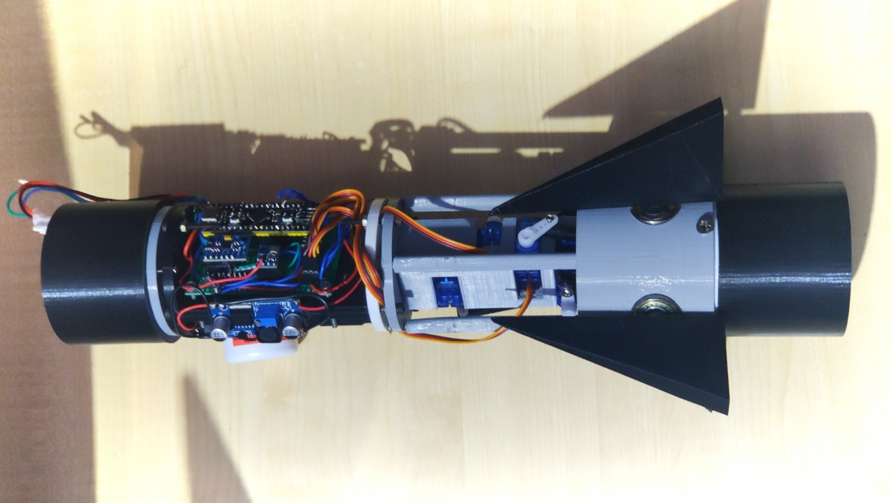
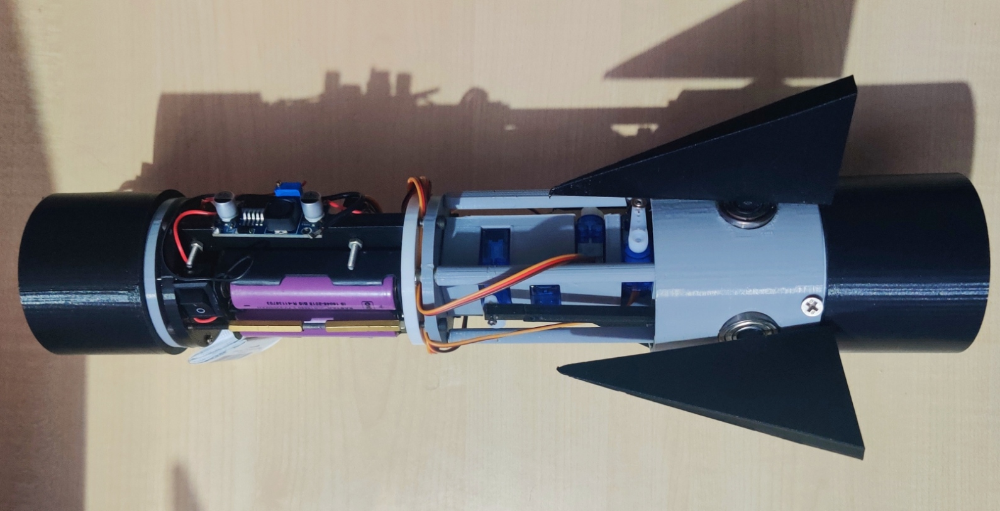

# Active fin stabilization on high power rocketry using Stm32 onboard flight controller.
In high-speed rocketry, stability and accurate trajectory control are crucial for performance and safety. Passive stabilization using fixed fins is often insufficient in the presence of crosswinds or trajectory disturbances. To address this, Active Fin Control Systems (AFCS) are developed to dynamically adjust fin angles during flight using real-time sensor data and onboard processing. This project focuses on the design and implementation of a compact, efficient flight controller capable of driving fin-mounted servos in response to orientation changes, improving stability and flight accuracy in amateur or research rocketry.

# CAD :
|  |  |
| --------------------------- | --------------------------- |

 

